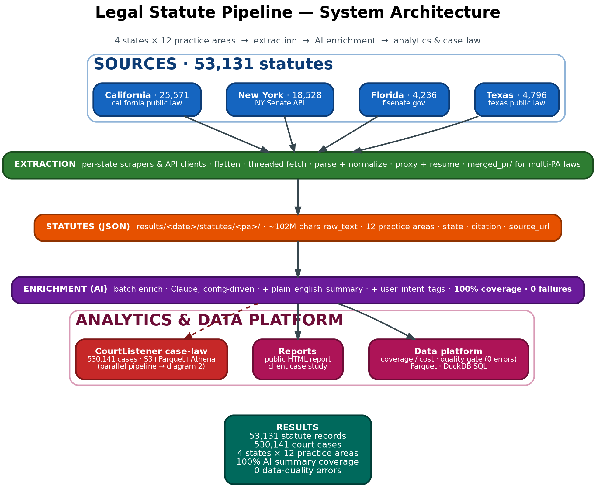
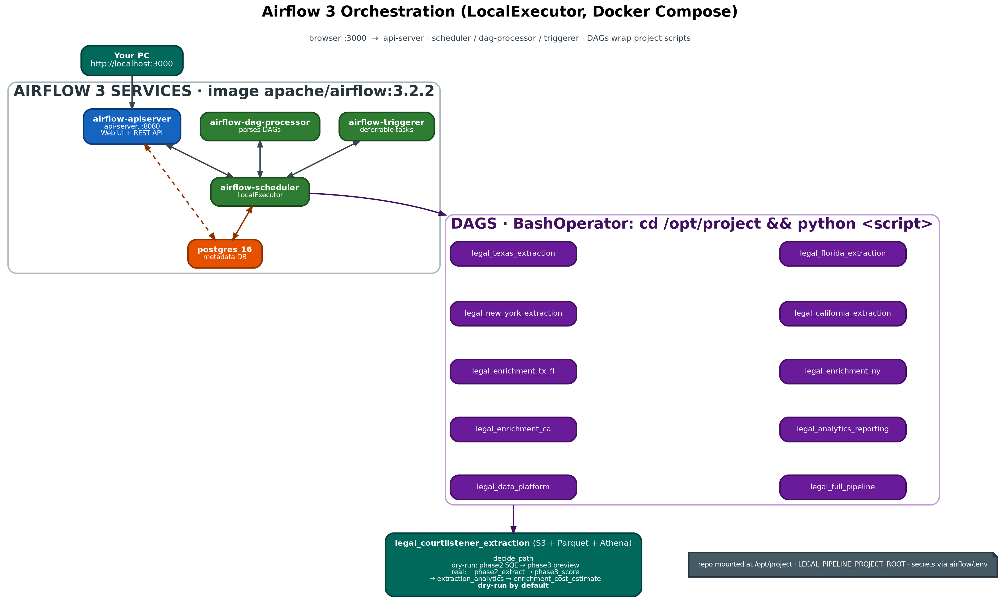
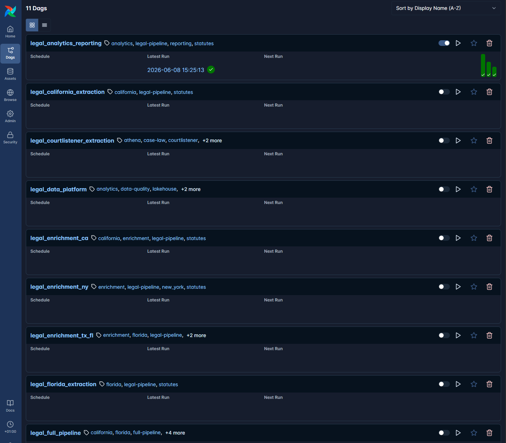
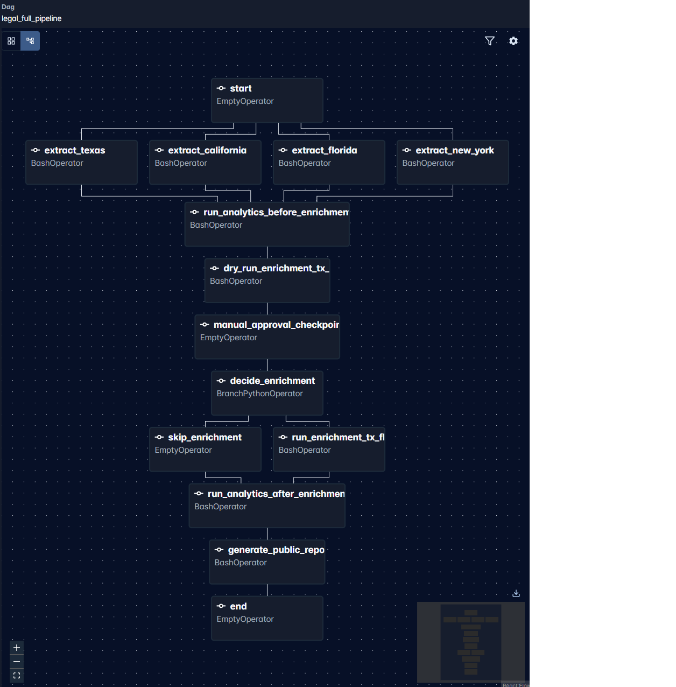
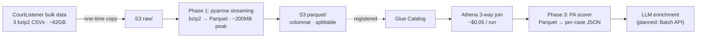
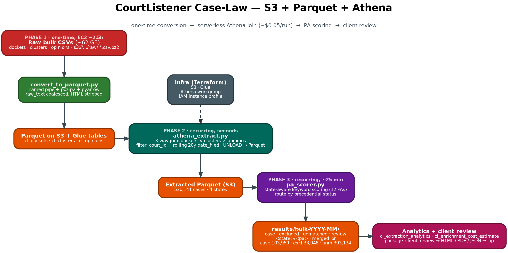

Due to client confidentiality, the production repository and dataset are private. This case study includes anonymized architecture, sample outputs, workflow screenshots, and a sanitized technical summary of the delivered system.

**GitHub Case Study Repo:**
https://github.com/mlordjames/legal-statute-platform-case-study

# Multi-State Legal Data Platform — Case Study

This repository is a sanitized public case study. It demonstrates the architecture, data model, workflow, and impact of the delivered platform while excluding confidential production code and datasets.

---

## 1. Project Overview

This was a **multi-state legal data platform** built for a *confidential legal tech client*. The goal was to transform scattered public legal sources — statutes and case law spread across dozens of state websites and bulk datasets — into a clean, normalized, queryable, analytics-ready dataset.

The platform extracts statute data from state-level legal sources, normalizes it into consistent schemas, enriches it with AI-generated summaries and metadata, processes case law from CourtListener bulk data, and stores everything in a lakehouse-style architecture suitable for SQL analytics and downstream product features.

## 2. Business Problem

Public legal data is deceptively hard to work with:

- It is **scattered** across many state websites, each with a different structure.
- Formats are **inconsistent** — HTML, PDFs, bulk archives, and ad-hoc layouts.
- It is **hard to search** in raw form and not normalized into comparable records.
- Processing it manually is **slow and expensive**, and does not scale across states.

The client needed a repeatable, scalable system that could turn this raw public material into structured data they could trust, search, and build products on.

## 3. Solution

An end-to-end platform that:

- Extracted statute data from state-level legal sources.
- Normalized records into consistent schemas.
- Organized data by **state, practice area, chapter, and section**.
- Enriched statute records with **AI-generated summaries, intent tags, and metadata**.
- Processed case law using **CourtListener bulk data**.
- Stored analytics-ready data in **lakehouse-style formats** (raw → clean → enriched zones, Parquet, Athena).
- Added **validation, checkpoint/resume, and reporting** workflows for reliability at scale.

## 4. My Role

**Founder & Data Lead at 7 Seer**

Responsibilities:

- Data architecture
- Pipeline design
- Web extraction workflows
- AWS data lake planning
- AI enrichment workflow design
- Validation and analytics reporting
- Client-ready documentation

## 5. Tech Stack

- **Python**
- **Playwright** (web extraction)
- **AWS S3** (lakehouse storage)
- **Parquet** (columnar analytics format)
- **Athena** (serverless SQL analytics)
- **Airflow** (orchestration)
- **Claude AI / LLM enrichment**
- **CourtListener bulk data** (case law)
- **JSON / CSV** (interchange formats)
- **Data validation scripts**
- **Checkpoint/resume processing**

## 6. System Architecture



*End-to-end system: 4 states × 12 practice areas → extraction → AI enrichment → analytics and case-law. ([SVG](diagrams/rendered/system_architecture.svg))*

See the detailed write-up and diagrams:

- [`docs/architecture.md`](docs/architecture.md)
- [`diagrams/pipeline_architecture.mmd`](diagrams/pipeline_architecture.mmd)
- [`diagrams/aws_lakehouse_architecture.mmd`](diagrams/aws_lakehouse_architecture.mmd)
- [`diagrams/enrichment_workflow.mmd`](diagrams/enrichment_workflow.mmd)
- [`diagrams/data_model.mmd`](diagrams/data_model.mmd)

## 7. Data Pipeline Summary

1. **Source discovery** — identify authoritative public statute and case-law sources per state.
2. **Extraction** — pull raw records using resilient, checkpointed extractors.
3. **Normalization** — map heterogeneous source formats into a consistent schema.
4. **Validation** — run data-quality checks before anything is enriched or stored.
5. **Storage** — land data in lakehouse zones (raw → clean → enriched) on S3.
6. **AI enrichment** — generate summaries, intent tags, and metadata with QA validation.
7. **Analytics** — query enriched Parquet data via Athena-style SQL.
8. **Reporting** — produce metrics, coverage, and quality reports.

### Orchestration (Airflow)

The whole pipeline runs as **Airflow 3** DAGs — each stage is a discrete, re-runnable task with explicit dependencies, schedulable and monitorable, and scaled state-by-state. Enrichment is **dry-run by default** with a manual approval checkpoint before any tokens are spent.



*Airflow 3 (LocalExecutor) orchestrating per-state extraction, enrichment, analytics, and case-law DAGs. ([SVG](diagrams/rendered/airflow_orchestration.svg))*

| DAGs list | `legal_full_pipeline` run graph |
|---|---|
|  |  |

*Workflow screenshots from the running Airflow UI: the 11 pipeline DAGs, and the full-pipeline graph (extraction → analytics → dry-run enrichment → manual approval → enrichment → reporting).*

## 8. Scale and Impact

- **53,000+** statute sections processed
- **530,000+** court case records processed
- **4 US states** covered (Texas, Florida, New York, California)
- **12 legal practice areas**
- Architecture **designed to scale toward all 50 US states**
- Avoided slow API-only crawling by using **bulk data** and **lakehouse design** where appropriate

## 9. Engineering Deep-Dive — CourtListener Case Law at Scale

The hardest part of the platform was **case law**: ingesting and structuring **~530,000 state court cases** from CourtListener's public corpus — a dataset whose raw opinion file alone is **54 GB compressed (~350 GB decompressed)**. Getting this reliable, cheap, and scalable drove the most interesting engineering on the project.

Full write-up with code: [`docs/engineering-deep-dive.md`](docs/engineering-deep-dive.md). Diagrams: [`diagrams/courtlistener_athena_pipeline.mmd`](diagrams/courtlistener_athena_pipeline.mmd) · [`diagrams/courtlistener_decision_flow.mmd`](diagrams/courtlistener_decision_flow.mmd).

### Architecture (final)





*One-time bzip2→Parquet conversion → serverless Athena join (~$0.05/run) → PA scoring → review. ([SVG](diagrams/rendered/courtlistener_athena.svg))*

### Bottlenecks → solutions

| Bottleneck | What was tried | Final solution | Result |
|---|---|---|---|
| REST API caps free tokens at **125 req/day**; ~530k cases need thousands of calls | Server-side filtered REST pagination | **Public bulk download** (3 CSVs, ~62 GB) | Months of crawling → one-time copy |
| 54 GB opinions file is a **single non-splittable bzip2 stream**; a silent decompressor crash wrote **625 of 530,034 rows** and reported success | 3-pass Python streaming on a small EC2 | **S3 + Parquet + Athena** (managed join owns parallelism, retries, errors) | Reliable; **~$0.05/query** |
| DuckDB assumes **seekable** descriptors — OOM on `COPY → s3://`, `lseek failed` on a named pipe | DuckDB HTTPFS → pipe → local-then-sync | **pyarrow `open_csv` on a file object** (true streaming, ~200 MB peak) | 350 GB decompressed on a small box |
| `plain_text`-only kept just **~32%** of cases (69% are HTML-only) | `plain_text`-only smoke test | **Coalesce** `plain_text` + 6 HTML/XML fallbacks → one cleaned `raw_text` | **99.98% non-empty** over **10.75M** opinions |
| Opinions Parquet (~40–50 GB) **overflowed root EBS** mid-run | End-of-run bulk upload | **Per-file stream-upload** to staging + delete local | **~512 MB disk peak** on any volume |

### Selected code

The silent-failure bug that wrote 0.12% of the data and the gate that now catches it:

```python
# BUG: stderr discarded, exit code never checked — a mid-stream decompressor
# crash looked identical to a clean EOF (625 of 530,034 rows, reported "OK").
proc = subprocess.Popen(cmd, stdout=subprocess.PIPE, stderr=subprocess.DEVNULL)
for row in csv.DictReader(proc.stdout):   # silently ends early
    ...

# FIX: fail loudly on non-zero exit AND on suspiciously low coverage.
if proc.returncode != 0:
    raise RuntimeError(f"decompressor exit {proc.returncode}\n{stderr_tail}")
if rows_written < expected * 0.8:
    raise RuntimeError(f"only {rows_written} of ~{expected} rows — aborting")
```

Streaming a non-seekable pipe with pyarrow (what replaced DuckDB):

```python
with open(pipe_path, "rb") as pipe:            # a FILE OBJECT, not a path → no lseek
    reader = pac.open_csv(
        pipe,
        read_options=pac.ReadOptions(block_size=64 * 1024 * 1024),
        parse_options=pac.ParseOptions(newlines_in_values=True),
        convert_options=pac.ConvertOptions(include_columns=KEEP_COLS),
    )
    for batch in reader:
        writer.write_batch(batch)              # flush each 64 MB block immediately
```

Recovering the HTML-only majority into one cleaned text column:

```python
# 69% empty plain_text → coalesce to one cleaned raw_text + a text_source tag.
raw_text = first_nonempty(
    plain_text, html_with_citations, html_lawbox,
    html_columbia, html, xml_harvard, html_anon_2020,   # anonymized source LAST
)  # HTML stripped (vectorized) at convert time; raw HTML never stored
```

The recurring extraction — one serverless Athena join, ~$0.05/run regardless of state count:

```sql
UNLOAD (
  SELECT o.cluster_id,
         array_join(array_agg(o.raw_text ORDER BY o."type"), chr(10)) AS raw_text,
         oc.case_name, oc.date_filed, oc.precedential_status, d.court_id
  FROM cl_opinions o
  JOIN cl_clusters oc ON o.cluster_id = oc.id
  JOIN cl_dockets  d  ON oc.docket_id = d.id
  WHERE d.court_id IN ( :approved_courts )      -- from config, not hardcoded
    AND oc.date_filed >= DATE '2006-01-01'
    AND length(trim(o.raw_text)) > 0
  GROUP BY o.cluster_id, oc.case_name, oc.date_filed, oc.precedential_status, d.court_id
) TO 's3://<data-lake>/athena-results/run_id=<utc_ts>/'
WITH (format = 'PARQUET', compression = 'SNAPPY')
```

### Cost engineering

- **Ephemeral, auto-terminating compute** — conversion runs on a short-lived EC2 box with a `--shutdown` flag that self-terminates on success (never on failure): `sudo shutdown -h now`. No idle instances.
- **Disk-bounded streaming + cleanup** — each ~512 MB Parquet file is uploaded then `unlink()`'d immediately, so a multi-hundred-GB job needs ~512 MB of disk; staging → verify → promote keeps the canonical dataset clean.
- **Convert once, query forever** — bzip2→Parquet is one-time per monthly snapshot (~$0.43 EC2 + ~$1/mo storage); every query reads the same Parquet (~$0.05, column-pruned) instead of re-downloading 62 GB.
- **Scale-flat querying** — adding states is a config change; Athena stays ~$0.05/run for 4 states or 50 (vs an estimated ~$40–50/run for the old EC2-streaming design at 50 states).
- **Planned batch enrichment** — case-law LLM enrichment over hundreds of thousands of records is routed through the provider's **Batch API**, with model right-sizing and text truncation, to roughly halve enrichment spend.

**All-in recurring cost: ~$0.40 per run** (Athena ~$0.05 + PA scoring ~$0.09 + S3 writes ~$0.27).

## 10. Sample Outputs

Sanitized, synthetic examples (no production data):

- [`data/sample_statute_record.json`](data/sample_statute_record.json)
- [`data/sample_enriched_record.json`](data/sample_enriched_record.json)
- [`data/sample_case_law_record.json`](data/sample_case_law_record.json)

## 11. Charts and Visuals

Charts are generated from the sanitized aggregate metrics:

```bash
pip install -r requirements.txt
python scripts/generate_charts.py
```

Output PNGs are written to `charts/`.

## 12. PDF Case Study

A polished, reviewer-friendly PDF case study is included:

```
Legal_Data_Platform_Case_Study_Fiverr_Pro.pdf
```

Regenerate it with:

```bash
python scripts/build_case_study_pdf.py
```

## 13. Confidentiality Note

This repository is a **sanitized case study**. It does **not** include private client code, full datasets, credentials, production outputs, private prompts, `.env` files, raw statute text, or full scraper logic. See [`docs/sanitization-notes.md`](docs/sanitization-notes.md) for exactly what was excluded.

## 14. About 7 Seer

7 Seer builds data pipelines, automation systems, AI-enriched datasets, and cloud data platforms for businesses that need reliable data collection, processing, and analytics.

## 15. Project Credits

| Role | Credit |
|---|---|
| **Project Developer** | Etiese James — Lead Data Engineer, 7 Seer |
| **Lead Agent** | Claude Code (Opus 4.8) |
| **Reviewer Agent** | OpenAI GPT |
