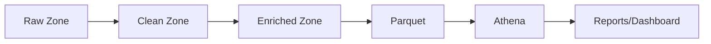
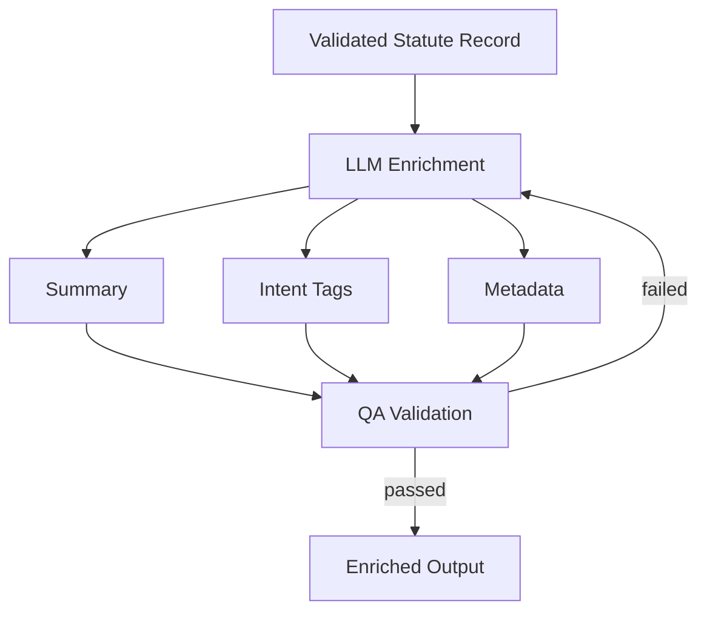

# System Architecture

> Sanitized overview. Production code, configuration, and internal paths are excluded.

The platform is organized as a sequence of clearly separated layers. Each layer has a single
responsibility, which makes the system easier to test, scale per-state, and resume after failures.

## Source Layer

Authoritative public sources are identified per state and per practice area: state legislature
statute sites for statutes, and CourtListener bulk data for case law. Sources are tracked so that
re-runs target the right material and coverage can be reported.

## Extraction Layer

Resilient extractors pull raw records from each source. Extraction is **checkpointed** so a long
state-level run can resume from where it stopped instead of restarting. Extraction is deliberately
kept **separate from enrichment** so that re-extracting a source never forces a costly re-enrichment.

## Normalization Layer

Heterogeneous source formats (HTML, bulk archives, varied layouts) are mapped into a single
consistent schema keyed by **state → practice area → chapter → section**. Normalization is where
inconsistent inputs become comparable, queryable records.

## Validation Layer

Data-quality checks run **before** storage and enrichment: required fields, structural integrity,
duplicate detection, and basic sanity checks. Records that fail validation are flagged rather than
silently enriched, which keeps downstream analytics trustworthy.

## Storage Layer

Validated data lands in a **lakehouse-style** design on S3 with progressive zones:

Case law and large datasets are stored as **Parquet** for efficient columnar analytics and queried
through an **Athena-compatible** SQL layer.

## AI Enrichment Layer

Validated statute records are enriched with an LLM to produce plain-English summaries, intent tags,
search keywords, and metadata. Each enrichment passes through **QA validation**; failures are routed
back for re-processing rather than accepted blindly.

## Analytics & Reporting Layer

Enriched, Parquet-backed data is queried with Athena-style SQL to produce coverage metrics, quality
reports, and aggregate statistics across states and practice areas.

## Orchestration Layer

The end-to-end flow is orchestrated in an **Airflow-style** manner: each stage is a discrete,
re-runnable task with explicit dependencies, so the pipeline can be scheduled, monitored, and scaled
state-by-state toward all 50 states.
