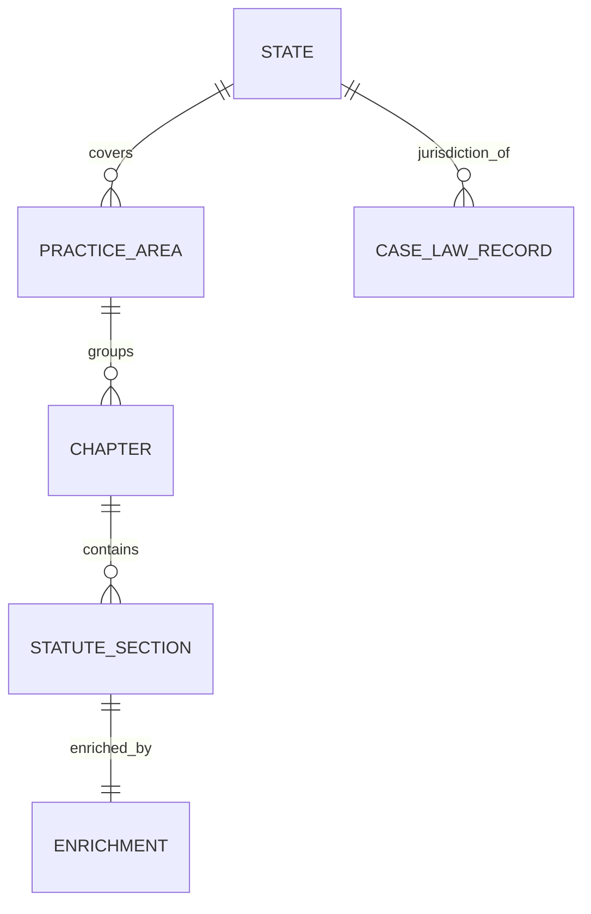

# Data Model

Sanitized schema overview. Field names below are representative; production schemas may include
additional internal fields that are not shown publicly.

## Statute Record

The core extracted unit, organized by state → practice area → chapter → section.

| Field | Type | Description |
|---|---|---|
| `state` | string | State code (e.g., `texas`). |
| `practice_area` | string | Legal practice area (e.g., `landlord_tenant`). |
| `source_type` | string | Source category (e.g., `public_statute`). |
| `chapter` | string | Chapter grouping (e.g., `Property Code Chapter 92`). |
| `section_id` | string | Stable identifier for the section. |
| `title` | string | Section title. |
| `raw_text_preview` | string | Sanitized preview only — full text excluded publicly. |
| `source_url` | string | Public source location. |
| `extraction_status` | string | e.g., `validated`. |
| `last_updated` | date | Last extraction/update date. |

See [`../data/sample_statute_record.json`](../data/sample_statute_record.json).

## Enriched Statute Record

The output of the AI enrichment layer, linked to a statute section by `section_id`.

| Field | Type | Description |
|---|---|---|
| `state` | string | State code. |
| `practice_area` | string | Practice area. |
| `section_id` | string | Links to the statute section. |
| `summary` | string | Plain-English summary for search/understanding. |
| `intent_tags` | string[] | Intent/topic tags. |
| `complexity_level` | string | e.g., `low` / `medium` / `high`. |
| `search_keywords` | string[] | Keywords for retrieval. |
| `validation_status` | string | QA result, e.g., `passed`. |

See [`../data/sample_enriched_record.json`](../data/sample_enriched_record.json).

## Case Law Record

Derived from CourtListener bulk data and stored for analytics.

| Field | Type | Description |
|---|---|---|
| `source` | string | e.g., `CourtListener bulk data`. |
| `jurisdiction` | string | Jurisdiction / state. |
| `case_id` | string | Stable case identifier. |
| `case_name` | string | Case caption. |
| `decision_date` | date | Date of decision. |
| `court` | string | Court name. |
| `text_preview` | string | Sanitized preview only. |
| `storage_format` | string | e.g., `parquet`. |
| `analytics_layer` | string | e.g., `athena-compatible`. |

See [`../data/sample_case_law_record.json`](../data/sample_case_law_record.json).

## Aggregate Metrics

Sanitized roll-up used for charts and reporting.

| Field | Type | Description |
|---|---|---|
| `states_covered` | int | Number of states covered. |
| `practice_areas` | int | Number of practice areas. |
| `statute_sections_processed` | int | Total statute sections processed. |
| `case_law_records_processed` | int | Total case-law records processed. |
| `architecture_target` | string | Scaling target. |
| `confidentiality` | string | Confidentiality note. |

See [`../data/aggregate_metrics.json`](../data/aggregate_metrics.json).
