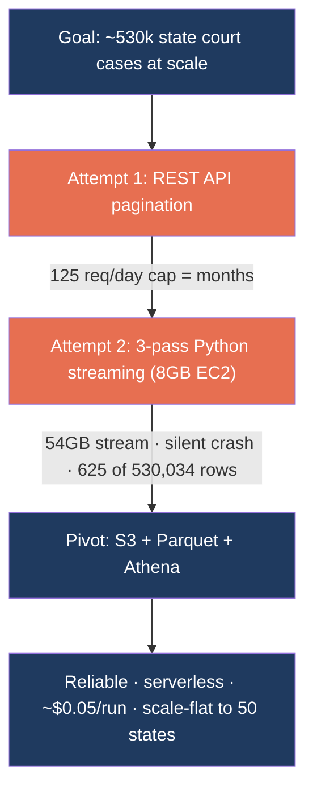

# Engineering Deep-Dive — CourtListener Case Law at Scale

> Sanitized engineering write-up. Infrastructure identifiers are genericized; no client data,
> credentials, or production secrets are included. The patterns below are from 7 Seer's own
> pipeline IP, shared here to demonstrate engineering depth.

The hardest part of the platform was **case law**: ingesting and structuring **~530,000 state
court cases** from CourtListener's public corpus — a dataset whose raw opinion file alone is
**54 GB compressed (~350 GB decompressed)**. This is the story of the bottlenecks hit, what was
tried, and the final architecture.



See also: [`../diagrams/courtlistener_athena_pipeline.mmd`](../diagrams/courtlistener_athena_pipeline.mmd)
and [`../diagrams/courtlistener_decision_flow.mmd`](../diagrams/courtlistener_decision_flow.mmd).

---

## Bottlenecks → solutions (summary)

| # | Bottleneck | What was tried | Final solution | Result |
|---|---|---|---|---|
| 1 | CourtListener REST API caps free tokens at **125 requests/day**; ~530k cases need thousands of calls (2–3 each) | Server-side filtered REST pagination | Switch to the **public bulk download** (3 CSV files, ~62 GB) | Months of crawling → a one-time copy |
| 2 | The 54 GB opinions file is a **single bzip2 stream** — not splittable, no seek, no partial retry; a 1.5 GB in-RAM join ran tight on 8 GB; a silent decompressor crash wrote **625 of 530,034 rows (0.12%)** and reported success | 3-pass Python streaming extractor on a small EC2 | **S3 + Parquet + Athena** — convert once, let a managed engine own the join, parallelism, retries, and error propagation | Reliable extraction; **~$0.05 per query** |
| 3 | DuckDB (first-choice converter) assumes **seekable** file descriptors — it OOM'd buffering `COPY ... TO s3://`, and hit `lseek failed` on a non-seekable named pipe | DuckDB HTTPFS → named pipe → local-then-sync (3 attempts) | **pyarrow `open_csv` on a Python file object** — a true streaming reader, ~200 MB peak | 350 GB decompressed processed on a small box |
| 4 | First conversion kept only `plain_text`, but **69% of in-scope opinions are HTML-only** → just **~32% case coverage** | `plain_text`-only (good smoke test, indefensible for a legal product) | **Coalesce** `plain_text` + 6 HTML/XML fallbacks into one cleaned `raw_text` (HTML stripped at convert time) | **99.98% non-empty** across **10.75M** opinions |
| 5 | Opinions Parquet (~40–50 GB) **overflowed the root EBS volume** mid-run | End-of-run bulk upload (fine for the small tables) | **Per-file streaming upload** to a staging prefix + delete local immediately; verify row counts, then promote to canonical | **~512 MB disk peak** — runs on any volume |

---

## 1. Why not the REST API

CourtListener publishes a clean REST API — the obvious starting point. But the free tier caps at
**125 requests/day**, and each opinion needs 2–3 calls (the court lives on the docket record). At
~530k cases across four states, that is **months** of crawling.

**Lesson:** always check whether a data provider offers **bulk exports** before building a REST
pagination crawler. APIs optimize for access patterns, not bulk transfer. CourtListener explicitly
publishes bulk downloads for exactly this use case.

## 2. Why streaming the 54 GB file failed (and how it failed silently)

The bulk approach started with a 3-pass Python streaming extractor: build an in-RAM index of
dockets, then clusters, then stream the 54 GB opinions file and join. It worked on small test files
and failed in production — and the *way* it failed is the real lesson:

```python
# BUG: stderr discarded and exit code never checked. When the decompressor
# crashed mid-stream, its closed pipe looked exactly like a clean EOF —
# the loop ended, the script ran the S3 sync and reported success.
proc = subprocess.Popen(cmd, stdout=subprocess.PIPE, stderr=subprocess.DEVNULL)
for row in csv.DictReader(proc.stdout):   # silently ends early on EOF
    ...
# (no proc.returncode check anywhere)  -> 625 of 530,034 rows written, "OK"
```

The fix is defensive subprocess handling **plus** a coverage gate that treats a suspiciously low
count as a failure:

```python
if proc.returncode != 0:                       # a non-zero exit is NOT success
    raise RuntimeError(f"decompressor exit {proc.returncode}\n{stderr_tail}")
if rows_written < expected * 0.8:              # 625 vs ~530,000 must abort loudly
    raise RuntimeError(f"only {rows_written} of ~{expected} rows — aborting")
```

Even with the bugs fixed, the architecture was structurally wrong at this scale: bzip2 is a single
non-splittable stream (no parallelism, no partial retry), the in-RAM join didn't scale, and the
passes were sequential. That triggered the pivot to a managed lakehouse.

**Lessons:** check subprocess exit codes; never discard `stderr`; **validate output counts before
declaring success** — "the job ran" is not "the job was correct."

## 3. The converter that fought the tool: DuckDB → pyarrow

Converting bzip2 CSV → Parquet looked trivial, but DuckDB (the first choice) assumes **seekable**
file descriptors. Reading bzip2 from S3 isn't supported by its HTTPFS extension; bridging with a
Linux **named pipe** then hit two walls — `COPY ... TO s3://` buffered the whole dataset (OOM), and
even local writes called `lseek` on the pipe (`lseek failed`, because pipes aren't seekable).

The fix was a reader **designed for streaming** — pyarrow over a Python file object:

```python
# Decompress bzip2 -> named pipe; pyarrow streams fixed blocks, ~200 MB peak.
with open(pipe_path, "rb") as pipe:            # a FILE OBJECT, not a path string -> no lseek
    reader = pac.open_csv(
        pipe,
        read_options=pac.ReadOptions(block_size=64 * 1024 * 1024),     # 64 MB chunks
        parse_options=pac.ParseOptions(newlines_in_values=True),       # multi-line text fields
        convert_options=pac.ConvertOptions(include_columns=KEEP_COLS), # project + cast in one pass
    )
    for batch in reader:
        writer.write_batch(batch)              # flush each block immediately
```

The non-obvious detail: `pac.open_csv("/path")` *also* memory-maps and calls `lseek`. Wrapping the
path in `open(..., "rb")` first forces pyarrow's streaming code path, which never seeks.

**Lesson:** named pipes are non-seekable, non-rewindable streams. Verify your tool's I/O
assumptions before committing to a pipe architecture — adapting a seek-dependent engine to a stream
is fighting the tool.

## 4. The coverage trap: `plain_text`-only hid two-thirds of the corpus

The first working conversion kept only the `plain_text` column. Measured in Athena, that captured
only **~32%** of in-scope cases — because **69% of opinions store their text only in HTML/XML
fields**. "Coverage" had quietly come to mean "plain_text-only," which is indefensible for a legal
product.

The fix coalesces the text at convert time so canonical Parquet stays one text-column wide while
recovering the HTML-only majority:

```python
# 69% empty plain_text -> coalesce to one cleaned raw_text + a text_source tag.
raw_text = first_nonempty(
    plain_text, html_with_citations, html_lawbox,
    html_columbia, html, xml_harvard, html_anon_2020,   # anonymized source LAST (can alter names)
)  # HTML stripped (vectorized in Arrow) during conversion; raw HTML is never stored
```

Result: **99.98% non-empty `raw_text` across 10.75M opinions** — and the case count for the legal
practice areas roughly tripled.

**Lesson:** verify *corpus* coverage (captured vs. available), not just that the pipeline ran. For
this corpus, **text-source availability** was a bigger coverage lever than the date window.

## 5. Recurring query: one Athena join, ~$0.05 per run

With Parquet on S3 registered in Glue, extraction is a single serverless SQL join. It aggregates
the opinion rows up to one row per case (cluster), filtered to approved courts and a rolling date
window:

```sql
UNLOAD (
  SELECT o.cluster_id,
         array_join(array_agg(o.raw_text ORDER BY o."type"), chr(10)) AS raw_text,
         oc.case_name, oc.date_filed, oc.precedential_status, d.court_id
  FROM cl_opinions o
  JOIN cl_clusters oc ON o.cluster_id = oc.id
  JOIN cl_dockets  d  ON oc.docket_id = d.id
  WHERE d.court_id IN ( :approved_courts )        -- loaded from config, not hardcoded
    AND oc.date_filed >= DATE '2006-01-01'
    AND length(trim(o.raw_text)) > 0
  GROUP BY o.cluster_id, oc.case_name, oc.date_filed, oc.precedential_status, d.court_id
) TO 's3://<data-lake>/athena-results/run_id=<utc_ts>/'
WITH (format = 'PARQUET', compression = 'SNAPPY')
```

Column pruning means the scan reads only a few GB, so the join costs **~$0.02–$0.05** — whether it
covers 4 states or 50.

---

## Cost engineering

Reliability was the priority, but the rebuild also cut cost by roughly **two orders of magnitude**
per run, with several deliberate choices:

- **Ephemeral, auto-terminating compute.** Parquet conversion runs on a short-lived EC2 box with a
  `--shutdown` flag that self-terminates on success (never on failure) — no idle instances left
  running after an unattended job:

  ```python
  if args.shutdown:
      subprocess.run(["sudo", "shutdown", "-h", "now"])   # only on success; skipped on error
  ```

- **Disk-bounded streaming + cleanup.** Each ~512 MB Parquet file is uploaded to a staging prefix
  and **deleted locally immediately**, so a multi-hundred-GB job needs only ~512 MB of disk at any
  moment. Staging → verify exact row counts → promote to canonical → verify again keeps the live
  dataset clean even if a run dies mid-flight:

  ```python
  for parquet_file in rotated_files():     # ~512 MB each
      s3_cp(parquet_file, staging_prefix)  # upload as produced
      parquet_file.unlink()                # then delete -> bounded disk
  ```

- **Convert once, query forever.** The bzip2 → Parquet conversion is one-time per monthly snapshot
  (~$0.43 of EC2 + ~$1/month of S3 storage). Every subsequent query reads the same columnar Parquet
  instead of re-downloading 62 GB.

- **Scale-flat querying.** Adding states is a config change (extra `court_id`s); Athena cost stays
  ~$0.05/run because the scan is column-pruned. The old EC2-streaming design would have cost an
  estimated **~$40–50/run at 50 states**.

- **Planned batch enrichment.** Case-law LLM enrichment over hundreds of thousands of records is
  routed through the provider's **Batch API**, with model right-sizing and `raw_text` truncation, to
  cut enrichment spend by roughly half versus naive per-record synchronous calls.

### All-in per-run cost (4 states, recurring)

| Step | Service | Cost |
|---|---|---|
| 3-way join | Athena (~3–5 GB scanned) | ~$0.02–0.05 |
| PA scoring (~30 min) | small EC2 | ~$0.09 |
| Per-case JSON writes | S3 PUTs | ~$0.27 |
| **Total** | | **~$0.40 / run** |

One-time Parquet conversion: **~$0.43 + ~$1/month** of S3 storage.

---

## Transferable lessons

1. Prefer **bulk exports** over REST pagination for large corpora.
2. **Fail loudly:** check exit codes, keep `stderr`, and gate on output counts.
3. Match the **tool to the I/O model** — streaming readers for non-seekable inputs.
4. Measure **coverage of the real corpus**, not just that the job completed.
5. Let **managed services own the hard parts** (joins, parallelism, retries).
6. Make compute **ephemeral and self-cleaning** — auto-shutdown and bounded disk turn a fragile,
   expensive job into a cheap, repeatable one.
